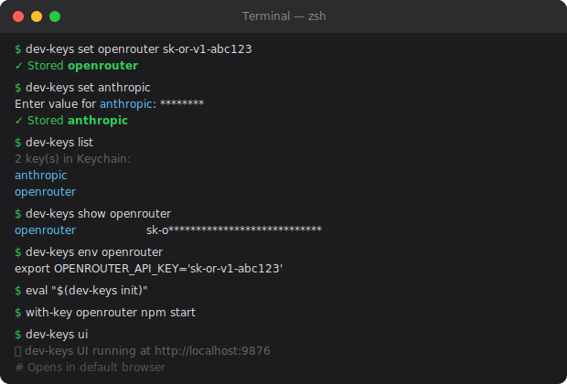
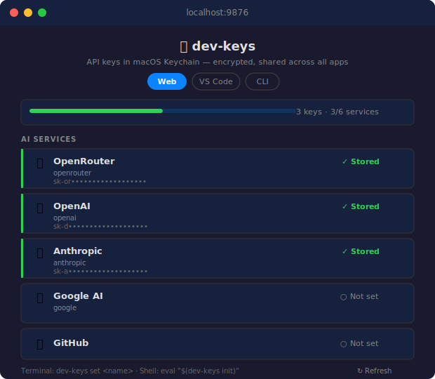

# AllOfUs

A modular AI agent framework with secure, cross-app API key management for macOS.

> Store API keys once in macOS Keychain. Access them from any terminal, script, Node.js app, VS Code extension, or browser.

## Overview

AllOfUs has two components that share a single macOS Keychain backend:

| Component | What it does |
|---|---|
| **dev-keys** | CLI + Web UI + VS Code extension for managing API keys in Keychain |
| **Agent** | Event-driven AI agent built on the [OpenRouter SDK](https://openrouter.ai/docs) |

---

## dev-keys

### Choose Your Interface

<table>
<tr>
<td width="33%" align="center"><strong>CLI</strong></td>
<td width="33%" align="center"><strong>Web UI</strong></td>
<td width="33%" align="center"><strong>VS Code</strong></td>
</tr>
<tr>
<td><code>dev-keys set openrouter</code></td>
<td><code>dev-keys ui</code></td>
<td>Cmd+Shift+P &rarr; Dev Keys: Open Setup Panel</td>
</tr>
</table>

All three read and write the same macOS Keychain entries. A key stored from the CLI is instantly available in VS Code and the web UI.

### CLI

<p align="center">
  
</p>

```
dev-keys v0.1.0 — API keys in macOS Keychain

COMMANDS
  set <name> [value]     Store a key (prompts securely if value omitted)
  get <name>             Print a key to stdout
  show <name>            Print key name + masked value
  delete <name>          Remove a key (with confirmation)
  list                   List all stored key names
  env [names...]         Print export statements for shell eval
  init                   Print shell startup script for .zshrc/.bashrc
  ui                     Open setup panel in your browser

OPTIONS
  --help, -h             Show this help
  --version, -v          Print version
```

**Terminal behavior:** Adapts to terminal capabilities automatically. Respects `NO_COLOR`, `CLICOLOR`, `CLICOLOR_FORCE`, and `TERM=dumb`. Falls back to ASCII glyphs when Unicode is unavailable. Adjusts column widths to terminal size. Disables color and prompts when piped.

### Web UI

<p align="center">
  
</p>

```bash
dev-keys ui
#  dev-keys UI running at http://localhost:9876
#  Opens in default browser
```

Features:
- Cards for 6 known AI services (OpenRouter, OpenAI, Anthropic, Google AI, GitHub, Hugging Face) with direct "Get key" links
- Progress bar showing configuration status
- Inline password inputs with show/hide toggle
- Add/update/remove keys with toast notifications
- Dark and light mode via `prefers-color-scheme`
- SSE-powered live sync across browser tabs
- Custom key support

### VS Code Extension

Open the command palette (`Cmd+Shift+P`) and run:

| Command | Description |
|---|---|
| **Dev Keys: Open Setup Panel** | Full setup UI as a webview panel |
| **Dev Keys: Add API Key** | Quick add via input box |
| **Dev Keys: Remove API Key** | Quick remove via picker |
| **Dev Keys: List API Keys** | View stored keys |

Any VS Code extension can request keys programmatically:

```typescript
const session = await vscode.authentication.getSession(
  'dev-api-keys',        // provider ID
  ['openrouter'],        // scope = key name
  { createIfNone: true } // prompts to add if missing
);
const apiKey = session.accessToken;
```

---

## Installation

### Requirements

- **macOS** (uses Keychain via the `security` CLI)
- **Node.js** >= 18
- [OpenRouter API key](https://openrouter.ai/settings/keys) (for the agent)

### Install Everything

```bash
git clone https://github.com/AnjinMeili/AllOfUs.git
cd AllOfUs

# Install dependencies
npm install
cd dev-keys && npm install && cd ..

# Build everything (agent + extension + VSIX)
npm run build:all

# Install CLI globally
ln -sf "$(pwd)/dev-keys/bin/dev-keys" /usr/local/bin/dev-keys

# Install VS Code extension
npm run install:ext
```

### Install dev-keys Only

If you just want key management without the agent:

```bash
cd dev-keys
npm install && npm run build

# CLI
ln -sf "$(pwd)/bin/dev-keys" /usr/local/bin/dev-keys

# VS Code extension
npm run install:vsix
```

### Verify Installation

```bash
dev-keys --version
# dev-keys 0.1.0

dev-keys set openrouter
# Enter value for openrouter: ********
# OK Stored openrouter

dev-keys list
# 1 key(s) in Keychain:
#   openrouter
```

---

## Usage

### Store and Retrieve Keys

```bash
# Store with value on the command line
dev-keys set openrouter sk-or-abc123

# Store with secure prompt (no value in shell history)
dev-keys set anthropic
# Enter value for anthropic: ********

# Retrieve (prints to stdout)
dev-keys get openrouter

# View masked
dev-keys show openrouter
# openrouter           sk-o****************************

# Remove (confirms interactively)
dev-keys delete openrouter
# Delete openrouter from Keychain? [y/N]
```

### Shell Integration

Add to `~/.zshrc` or `~/.bashrc` for automatic key loading:

```bash
eval "$(dev-keys init)"
```

This does two things:
1. Exports all stored keys as `<NAME>_API_KEY` environment variables
2. Provides a `with-key` helper function

```bash
# After eval "$(dev-keys init)":
echo $OPENROUTER_API_KEY
# sk-or-abc123

# Run a command with a specific key injected
with-key openrouter npm start
```

### Use in Scripts

```bash
# Inline (no shell config needed)
OPENROUTER_API_KEY=$(dev-keys get openrouter) npm start

# Export specific keys
eval $(dev-keys env openrouter anthropic)

# Use in curl
curl -H "Authorization: Bearer $(dev-keys get openrouter)" https://api.example.com
```

### Use Without dev-keys Installed

Every command is a thin wrapper around macOS `security`. You can always access keys directly:

```bash
# Store
security add-generic-password -s dev-api-keys -a openrouter -w "sk-or-abc123" -U

# Retrieve
security find-generic-password -s dev-api-keys -a openrouter -w

# Use inline
OPENROUTER_API_KEY=$(security find-generic-password -s dev-api-keys -a openrouter -w) npm start
```

### Use in Node.js

```typescript
import { getKey } from './get-key.js';

// Checks OPENROUTER_API_KEY env var first, falls back to Keychain
const apiKey = getKey('openrouter');
```

### Access Patterns Summary

| Consumer | Method |
|---|---|
| **CLI / shell scripts** | `dev-keys get <name>` or `eval $(dev-keys env)` |
| **Node.js** | `import { getKey } from './get-key.js'` |
| **VS Code extensions** | `vscode.authentication.getSession('dev-api-keys', ['openrouter'])` |
| **Web UI** | `dev-keys ui` (localhost:9876) |
| **Any macOS app** | `security find-generic-password -s dev-api-keys -a <name> -w` |
| **Python, Ruby, etc.** | Shell out to `security find-generic-password ...` |

---

## Agent

An event-driven AI agent built on the OpenRouter SDK with items-based streaming.

### Run the Agent

```bash
# Store your key (if not already done)
dev-keys set openrouter

# Headless (readline)
npm run start:headless

# Ink TUI
npm start
```

No environment variable needed -- the agent reads from Keychain automatically via `getKey('openrouter')`.

### Architecture

```
User Input --> Agent.send() --> OpenRouter SDK --> callModel()
                                                      |
                                               getItemsStream()
                                                      |
                                          Events: item:update, stream:delta,
                                                  tool:call, reasoning:update
                                                      |
                                                UI / Hooks / Logs
```

### Agent API

```typescript
import { createAgent } from './agent.js';
import { getKey } from './get-key.js';

const agent = createAgent({
  apiKey: getKey('openrouter'),
  model: 'openrouter/auto',
  instructions: 'You are a helpful assistant.',
  tools: [...],
  maxSteps: 5,
});

// Streaming
const response = await agent.send('Hello');

// Non-streaming
const response = await agent.sendSync('Hello');

// Events
agent.on('stream:delta', (delta, accumulated) => { ... });
agent.on('tool:call', (name, args) => { ... });
agent.on('error', (err) => { ... });
```

### Events

| Event | Payload | Description |
|---|---|---|
| `message:user` | `Message` | User message added |
| `message:assistant` | `Message` | Assistant response complete |
| `item:update` | `StreamableOutputItem` | Streaming item (replace by ID) |
| `stream:delta` | `(delta, accumulated)` | New text chunk |
| `tool:call` | `(name, args)` | Tool invoked |
| `tool:result` | `(callId, result)` | Tool returned |
| `thinking:start` / `end` | -- | Processing lifecycle |
| `error` | `Error` | Error occurred |

---

## Permissions Audit

Audit permission and prompt-risk configuration across VS Code, extensions, and project settings.

```bash
# Full audit
npm run audit:perms -- --scope all

# Project-only
npm run audit:perms -- --scope project

# JSON output
npm run audit:perms -- --scope project --format json

# Interactive web report
npm run audit:perms -- --scope all --format web --interactive --open-browser
```

Exit codes: `0` clean, `1` warnings, `2` failures.

---

## Project Structure

```
AllOfUs/
├── src/
│   ├── agent.ts           # Agent core (EventEmitter + OpenRouter SDK)
│   ├── tools.ts           # Example tools (time, calculator)
│   ├── get-key.ts         # Key resolver: env var --> Keychain fallback
│   ├── headless.ts        # Headless CLI entry point
│   ├── cli.tsx            # Ink TUI entry point
│   └── audit-permissions.ts
├── dev-keys/
│   ├── bin/dev-keys       # CLI (bash, POSIX-compatible)
│   ├── src/
│   │   ├── keychain.ts    # Async Keychain bindings
│   │   ├── extension.ts   # VS Code AuthenticationProvider
│   │   ├── setup-panel.ts # VS Code webview panel UI
│   │   └── web-server.ts  # Standalone HTTP server + browser UI
│   ├── package.json       # npm + VS Code extension manifest
│   └── dev-keys-*.vsix    # Packaged VS Code extension
├── docs/images/           # Documentation assets
├── CLAUDE.md              # Claude Code project instructions
├── AGENTS.md              # OpenAI Codex project instructions
├── .github/
│   └── copilot-instructions.md  # GitHub Copilot instructions
├── CONTRIBUTING.md
├── SECURITY.md
├── LICENSE                # MIT
└── package.json
```

## npm Scripts

| Script | Description |
|---|---|
| `npm start` | Run agent with Ink TUI |
| `npm run start:headless` | Run agent with readline |
| `npm run dev` | Run agent with file watching |
| `npm run check` | Type-check with `tsc --noEmit` |
| `npm run build` | Compile TypeScript |
| `npm run build:all` | Build agent + dev-keys + VSIX |
| `npm run install:ext` | Install VSIX into VS Code |
| `npm run audit:perms` | Run permissions audit |

---

## Security

- API keys are stored in macOS Keychain, encrypted at rest by the OS
- The `security` CLI is used for all Keychain access — no native Node addons
- `.gitignore` excludes `.env` files
- The `dev-keys ui` server binds to `127.0.0.1`, validates the `Host`
  header, and requires a per-launch session token on every request
- Keys reachable in environment variables (via `with-key` or `dev-keys env`)
  are visible to child processes and may be captured by `ps` or shell history
- See [THREAT_MODEL.md](THREAT_MODEL.md) for what is and isn't defended
  against, and [SECURITY.md](SECURITY.md) for vulnerability reporting

## Contributing

See [CONTRIBUTING.md](CONTRIBUTING.md) for development setup and guidelines.

## License

[MIT](LICENSE)
